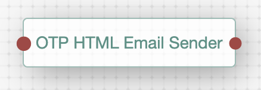
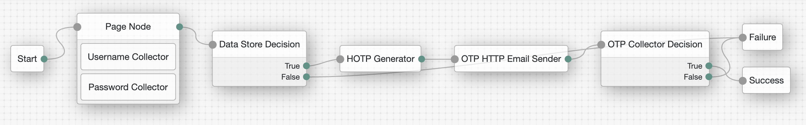

<!--
 * The contents of this file are subject to the terms of the Common Development and
 * Distribution License (the License). You may not use this file except in compliance with the
 * License.
 *
 * You can obtain a copy of the License at legal/CDDLv1.0.txt. See the License for the
 * specific language governing permission and limitations under the License.
 *
 * When distributing Covered Software, include this CDDL Header Notice in each file and include
 * the License file at legal/CDDLv1.0.txt. If applicable, add the following below the CDDL
 * Header, with the fields enclosed by brackets [] replaced by your own identifying
 * information: "Portions copyright [year] [name of copyright owner]".
 *
 * Copyright 2020 ForgeRock AS.
-->
# One Time Password Html Email Sender Auth Node

A simple authentication node for ForgeRock's [Identity Platform][forgerock_platform] 6.5.3 and above. This node will send an email with a OTP to the user with a custom body. It will take plain text or HTML.

## Information

This node adds support for a custom email body while using the OTP functionality. Most of the companies have the need to change the look and feel from the body of this type of emails. This Node will make this task easier on you.

## Usage
Follow the steps below to deploy this node:

1) Copy the .jar file from the ../target directory into the ../web-container/webapps/openam/WEB-INF/lib directory where AM is deployed.  
2) Restart the web container to pick up the new node.  
3) The node will then appear in the authentication trees components palette.

This is the node that will be available after deploying the jar file:

## Node Properties

* **Mail Server Host Name** - The name of the mail server AM will use to send the messages.
* **Mail Server Host Port** - The port of the mail server. The default port for SMTP is 25, if using SSL the default port is 465.
* **Mail Server Authentication Username** - The username to use when the mail server is using SMTP authentication.
* **Mail Server Authentication Password** - The password to use when the mail server is using SMTP authentication.
* **Email From Address** - Emails from the OTP Email Sender node will come from this address.
* **Email Attribute Name** - This is the attribute name used by the OTP Sender to email the user
* **Email Body Type** - You have the options to use INLINE or File based. INLINE will allow you to type the email body in the Email Body Value field.
                        File based allows you to specify an URL with a path to an HTML or text file where the email body field resides.
* **Email Body Value** - If you chose INLINE in the Email body type field, enter the email body text here. You may use plain text or HTML.
                         If you chose File based in the Email body type, enter the URL with the full path to the file where the html or plain text resides.
                         e.g.: http://webserver.example.com/resources/emailBody.html
                         We will always append the following to the end of your custom body value: "Your one time password is:"
* **Mail Server Secure Connection** - This setting controls whether the authentication module communicates with the mail server using SSL/TLS.

**Configuring the OTP HTML Mail Sender Node in the Tree**

        
The sample code described herein is provided on an "as is" basis, without warranty of any kind, to the fullest extent permitted by law. ForgeRock does not warrant or guarantee the individual success developers may have in implementing the sample code on their development platforms or in production configurations.

ForgeRock does not warrant, guarantee or make any representations regarding the use, results of use, accuracy, timeliness or completeness of any data or information relating to the sample code. ForgeRock disclaims all warranties, expressed or implied, and in particular, disclaims all warranties of merchantability, and warranties related to the code, or any service or software related thereto.

ForgeRock shall not be liable for any direct, indirect or consequential damages or costs of any type arising out of any action taken by you or others related to the sample code.

[forgerock_platform]: https://www.forgerock.com/platform/  
